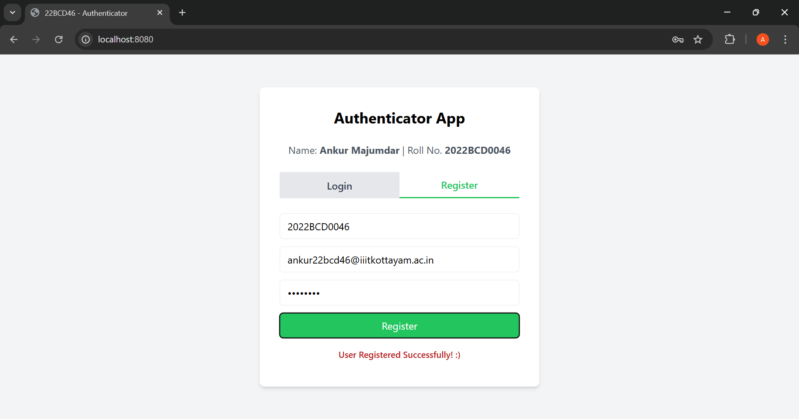

# <center>Assignment - 1: Authenticator (Microservices-Based App)</center>
### Name: Ankur Majumdar
### Roll No: 2022BCD0046

***

## 1. Overview

My Authentication (Microservices-Based) App is a simple web application that allows users to register and login including:
- **Web Service:** HTML, Node.js + Express.js app serving HTTP Requests with a simple Authentication functionality.
- **Worker Service:** Node.js Worker for async Tasks
- **Database Service:** PostgreSQL Database for Data Persistence

The Service is Accessible at `http://localhost:8080` with the Help of Docker...

**GitHub Repo:** [https://github.com/Ankur7891/Auth-App](https://github.com/Ankur7891/Auth-App)

***

## 2. Application Components

### A. Web Service
`frontend / index.html`
```html
<!DOCTYPE html>
<html lang="en">
<head>
    <meta charset="UTF-8">
    <meta name="viewport" content="width=device-width, initial-scale=1.0">
    <title>22BCD46 - Authenticator</title>
    <script src="https://cdn.tailwindcss.com"></script>
    <script>
        function switchTab(tab) {
            const loginTab = document.getElementById('loginTab');
            const registerTab = document.getElementById('registerTab');
            const loginForm = document.getElementById('loginForm');
            const registerForm = document.getElementById('registerForm');
            if (tab === 'login') {
                loginTab.classList.add('bg-white', 'text-blue-500', 'border-b-2', 'border-blue-500');
                loginTab.classList.remove('bg-gray-200', 'text-gray-700');
                registerTab.classList.add('bg-gray-200', 'text-gray-700');
                registerTab.classList.remove('bg-white', 'text-blue-500', 'border-b-2', 'border-blue-500');
                loginForm.classList.remove('hidden');
                registerForm.classList.add('hidden');
            } else {
                registerTab.classList.add('bg-white', 'text-green-500', 'border-b-2', 'border-green-500');
                registerTab.classList.remove('bg-gray-200', 'text-gray-700');
                loginTab.classList.add('bg-gray-200', 'text-gray-700');
                loginTab.classList.remove('bg-white', 'text-blue-500', 'border-b-2', 'border-blue-500');
                registerForm.classList.remove('hidden');
                loginForm.classList.add('hidden');
            }
        }
        async function handleAuth(action) {
            const messageEl = document.getElementById("message");
            messageEl.classList.add('hidden');
            const username = document.getElementById(`${action}Username`).value.trim();
            const password = document.getElementById(`${action}Password`).value.trim();
            const email = action === 'register' ? document.getElementById("email").value.trim() : null;
            if (!username || !password || (action === 'register' && !email)) {
                messageEl.innerText = "All Fields are Required!";
                messageEl.classList.remove('hidden');
                return;
            }
            const endpoint = `http://localhost:8081/${action}`;
            const payload = action === 'register' ? { username, email, password } : { username, password };
            try {
                const response = await fetch(endpoint, {
                    method: "POST",
                    headers: { "Content-Type": "application/json" },
                    body: JSON.stringify(payload)
                });
                const result = await response.json();
                messageEl.innerText = result.message || result.token || "Error";
                messageEl.classList.remove('hidden');
            } catch (error) {
                messageEl.innerText = "Request failed";
                messageEl.classList.remove('hidden');
            }
        }
    </script>
</head>
<body class="bg-gray-100 flex items-center justify-center min-h-screen">
    <div class="bg-white h-[30rem] p-8 rounded-lg shadow-md w-full max-w-md">
        <h2 class="text-2xl font-bold text-center">Authenticator App</h2>
        <p class="text-center text-gray-600 my-6">Name: <strong>Ankur Majumdar</strong> | Roll No. <strong>2022BCD0046</strong>
        </p>
        <div class="flex mb-6">
            <button id="loginTab" onclick="switchTab('login')"
                class="flex-1 py-2 px-4 text-center bg-white border-b-2 border-blue-500 text-blue-500 font-semibold">Login</button>
            <button id="registerTab" onclick="switchTab('register')"
                class="flex-1 py-2 px-4 text-center bg-gray-200 text-gray-700 font-semibold">Register</button>
        </div>
        <div id="loginForm">
            <input type="text" id="loginUsername" placeholder="Username"
                class="w-full px-3 py-2 mb-3 border rounded-md">
            <input type="password" id="loginPassword" placeholder="Password"
                class="w-full px-3 py-2 mb-3 border rounded-md">
            <button onclick="handleAuth('login')"
                class="w-full bg-blue-500 text-white py-2 rounded-md hover:bg-blue-600 transition duration-300">Login</button>
        </div>
        <div id="registerForm" class="hidden">
            <input type="text" id="registerUsername" placeholder="Username"
                class="w-full px-3 py-2 mb-3 border rounded-md">
            <input type="email" id="email" placeholder="Email" class="w-full px-3 py-2 mb-3 border rounded-md">
            <input type="password" id="registerPassword" placeholder="Password"
                class="w-full px-3 py-2 mb-3 border rounded-md">
            <button onclick="handleAuth('register')"
                class="w-full bg-green-500 text-white py-2 rounded-md hover:bg-green-600 transition duration-300">Register</button>
        </div>
        <p id="message" class="mt-4 text-center text-sm text-red-700 font-semibold hidden"></p>
    </div>
</body>
</html>
```

`backend / server.js`
```js
require('dotenv').config();
const express = require('express');
const cors = require('cors');
const { signupUser, loginUser } = require('./worker');

const PORT = 8081;
const app = express();

app.use(cors());
app.use(express.json());

app.post('/register', signupUser);
app.post('/login', loginUser);

app.listen(PORT, () =>
  console.log(`Server Running at http://localhost:${PORT}`)
);
```

***

### B. Worker Service
`backend / worker.js`
```js
const bcrypt = require('bcryptjs');
const { Pool } = require('pg');
const jwt = require('jsonwebtoken');

const pool = new Pool({
  user: process.env.DB_USER,
  host: process.env.DB_HOST,
  database: process.env.DB_NAME,
  password: process.env.DB_PASS,
  port: process.env.DB_PORT,
});
const SECRET_KEY = process.env.JWT_SECRET;

async function signupUser(req, res) {
  const { username, email, password } = req.body;
  const hashedPassword = await bcrypt.hash(password, 10);
  try {
    await pool.query(
      'INSERT INTO users (username, email, password) VALUES ($1, $2, $3)',
      [username, email, hashedPassword]
    );
    res.json({ message: 'User Registered Successfully! :)' });
  } catch (error) {
    console.log(error);
    res.status(500).json({ message: "ERROR :(" });
  }
}

async function loginUser(req, res) {
  const { username, password } = req.body;
  try {
    const result = await pool.query('SELECT * FROM users WHERE username = $1', [
      username,
    ]);
    if (result.rows.length === 0)
      return res.status(400).json({ message: 'User Not Found!' });

    const user = result.rows[0];
    const isValid = await bcrypt.compare(password, user.password);
    if (!isValid) return res.status(400).json({ message: 'Invalid Credentials!' });

    const token = jwt.sign({ id: user.id, email: user.email }, SECRET_KEY, {
      expiresIn: '1h',
    });
    res.json({ message: 'Login Successful, Welcome & Bye! :)' });
  } catch (error) {
    console.log(error);
    res.status(500).json({ message: 'ERROR :(' });
  }
}

module.exports = { signupUser, loginUser };
```

***

### C. Database Service
`db / init.sql`
```sql
CREATE TABLE users (
    username TEXT PRIMARY KEY NOT NULL,
    email TEXT UNIQUE NOT NULL,
    password TEXT NOT NULL
);
```


***

## 3. Configurations

### A. Docker Compose File
`docker-compose.yaml`
```yaml
version: '3.8'

services:
  db:
    image: postgres:latest
    container_name: db_22bcd46
    restart: always
    environment:
      POSTGRES_USER: ankur
      POSTGRES_PASSWORD: ankur22bcd46
      POSTGRES_DB: postgres
    ports:
      - '5432:5432'
    volumes:
      - db_data:/var/lib/postgresql/data
      - ./db/init.sql:/docker-entrypoint-initdb.d/init.sql

  backend:
    build: ./backend
    container_name: backend_22bcd46
    image: ankur/22bcd46-backend:latest
    restart: always
    environment:
      DB_USER: ankur
      DB_PASS: ankur22bcd46
      DB_NAME: postgres
      DB_HOST: db
      DB_PORT: 5432
      JWT_SECRET: secret
    depends_on:
      - db
    ports:
      - '8081:8081'

  frontend:
    build: ./frontend
    container_name: frontend_22bcd46
    image: ankur/22bcd46-frontend:latest
    restart: always
    depends_on:
      - backend
    ports:
      - '8080:80'

volumes:
  db_data:
```

***

### B. Dockerfile
`backend / Dockerfile`
```Dockerfile
# Use Node.js Image to Run the Backend
FROM node:18

# Set Working Directory
WORKDIR /app

# Copy Package Files and Install Dependencies
COPY package.json package-lock.json ./
RUN npm install

# Copy Backend Files
COPY . .

# Expose Port
EXPOSE 8081

# Start the Node.js Server
CMD ["node", "server.js"]
```

`frontend / Dockerfile`
```Dockerfile
# Use Nginx Image to Serve Our Frontend
FROM nginx:alpine

# Copy Frontend File to the Nginx HTML Directory
COPY index.html /usr/share/nginx/html/index.html

# Expose Nginx Default HTTP Port
EXPOSE 80

# Start Nginx
CMD ["nginx", "-g", "daemon off;"]
```

***

### C. Other Configurations
`backend / .env`
```sh
DB_HOST=localhost
DB_NAME=postgres
DB_USER=ankur
DB_PASS=ankur22bcd46
DB_PORT=5432
JWT_SECRET=secret
```

`nginx.conf`
```conf
events {}

http {
    server {
        listen 80;

        location / {
            proxy_pass http://frontend:80;
        }
    }
}
```

***

## 4. Running the Application

### A. Build Docker Images via Docker Compose & Run their Containers
```sh
docker-compose up --build
```


### B. Verify Running Containers
```sh
docker ps
```


***

## 5. Access the Application

### A. Web Application
- Open `http://localhost:8080` in a Browser.
- Register First If Not Done...

- You are all set to Login

- Invalid Crediantials Error If You Entry it Wrong...


### B. Database Entry


### C. Worker Logs
```sh
docker logs db_22bcd46
```


***

## <center>Thank You!</center>

